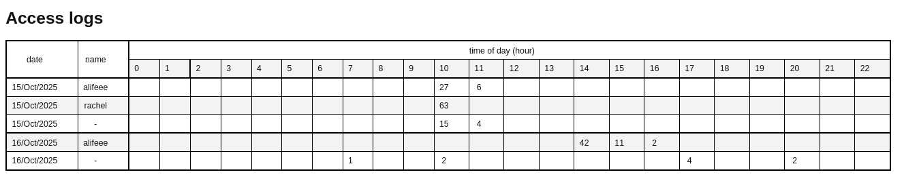

# Simple nginx access log page

Designed for an `nginx` setup that expects login from multiple users using HTTP basic authentication.



## Scripts

```bash
# show simple parsing of logs
$ ./parse-log.sh
user,first access,last access
-,15/Oct/2025:10:39:22 +0100,15/Oct/2025:13:07:30 +0100
alifeee,15/Oct/2025:10:38:39 +0100,15/Oct/2025:11:11:42 +0100
rachel,15/Oct/2025:10:51:43 +0100,15/Oct/2025:10:51:48 +0100

total   user
     44 -
     33 alifeee
     63 rachel

# parse logs to CSV of "access by hour"
$ ./log-to-csv.sh
Wed 15 Oct 13:21:54 BST 2025
saving nginx summary from logs/access.log
15/Oct/2025,alifeee,,,,,,,,,,,27,6,,,,,,,,,,,,
15/Oct/2025,rachel,,,,,,,,,,,63,,,,,,,,,,,,,
15/Oct/2025,-,,,,,,,,,,,15,10,18,1,,,,,,,,,,

# make history CSV into HTML file for nice viewing
$ ./history-to-html.sh
writing html
done!
```

## Setup

```bash
# clone files
mkdir -p /usr/alifeee/
git clone git@github.com:alifeee/nginx-user-dashboard /usr/alifeee/nginx-user-dashboard
# set up symlinks to scripts
sudo mkdir -p /etc/logrotate.d/http-prerotate
sudo ln -s /usr/alifeee/nginx-user-dashboard/nginx-user-dashboard /etc/logrotate.d/http-prerotate/nginx-user-dashboard
# set up symlink to HTML file
sudo ln -s /usr/alifeee/nginx-user-dashboard/history.html /var/www/html/access.html
# set up permissions
sudo touch history.html
sudo chown a+w /usr/alifeee/nginx-user-dashboard/history.{csv,html}
```

folders and files:

- /usr/alifeee/nginx-user-logging
- /etc/logrotate.d/nginx
- /etc/logrotate.d/httpd-prerotate (symlink to nginx-logging)

logrotate tests

- sudo logrotate -v -f /etc/logrotate.d/nginx
- sudo logrotate -d -v -f /etc/logrotate.d/nginx
